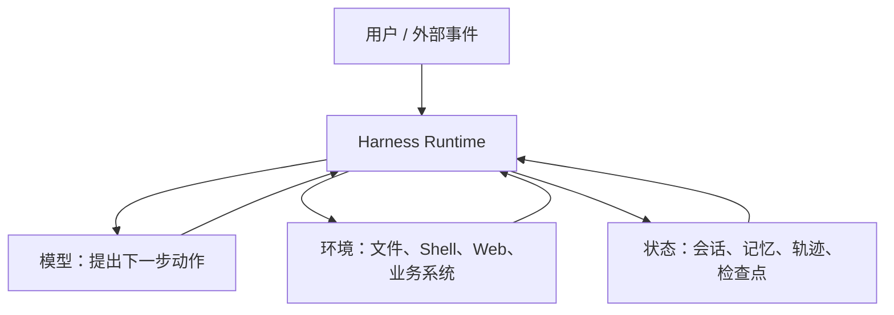
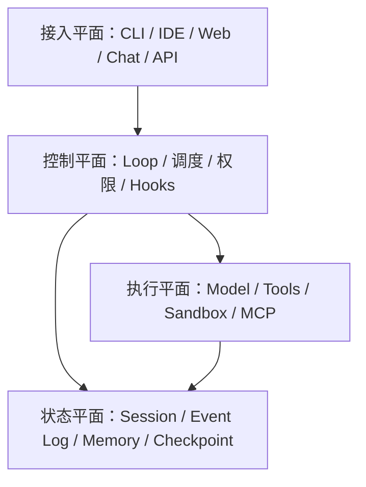
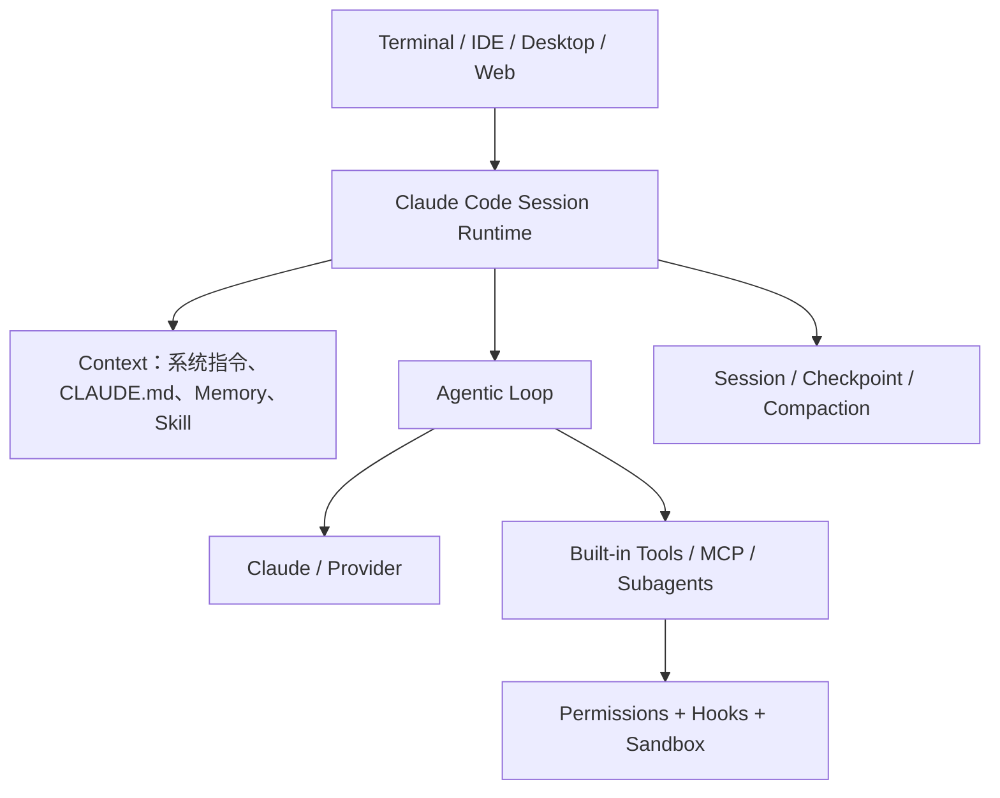
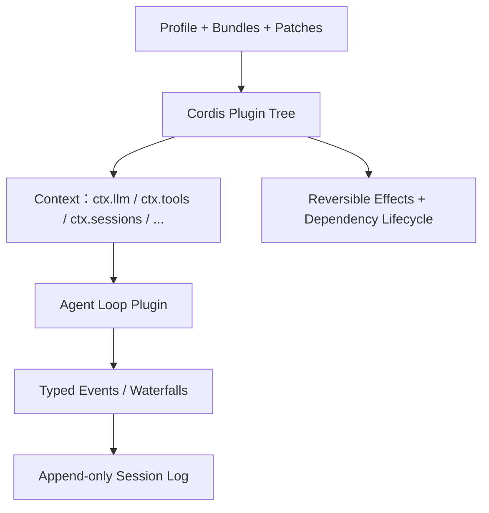
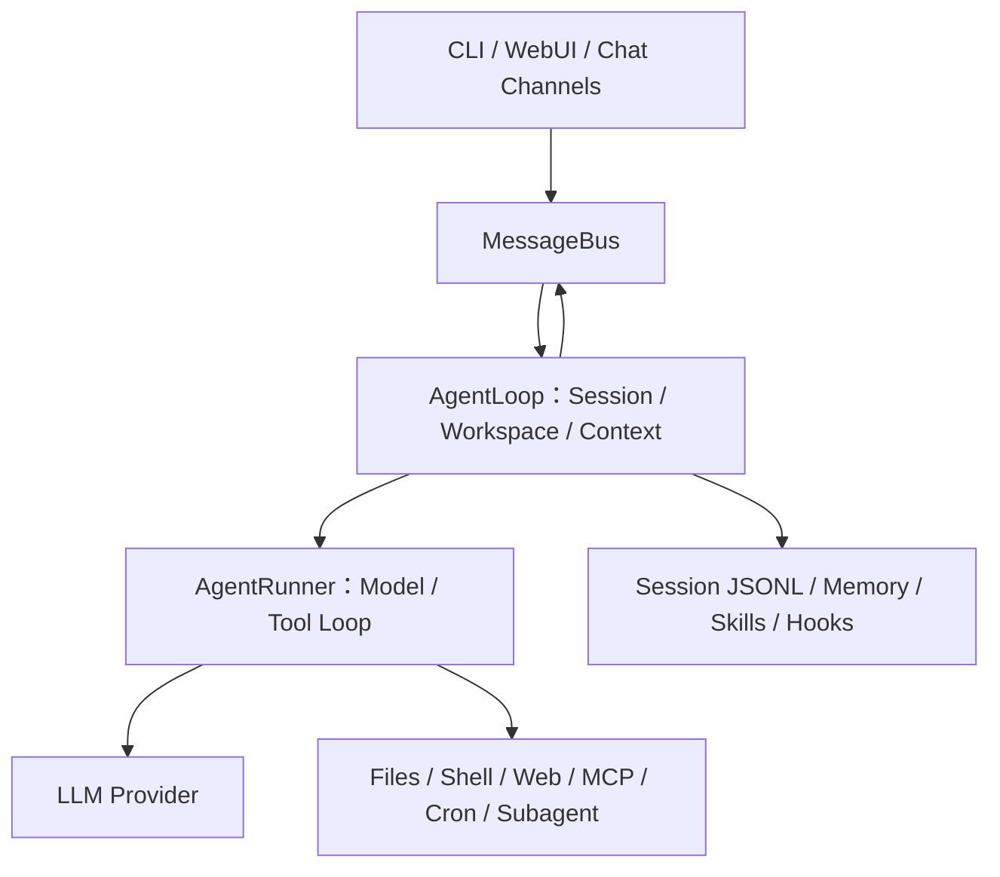
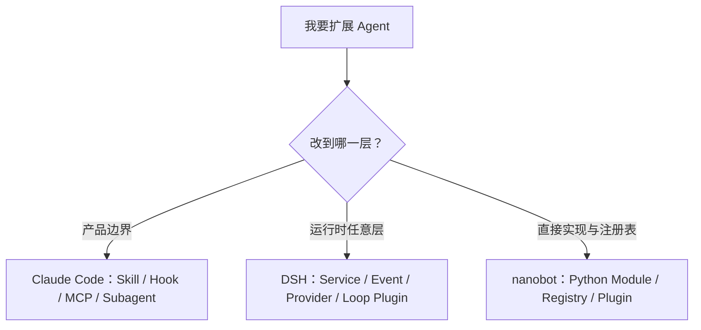

# 学习文档：从一条任务读懂 Agent Harness

先读上篇十讲，理解为什么 Agent 需要工程内核；已有经验的读者可直接查下篇专题。sonic 自己的产品决定与当前能力在[设计说明](./设计说明.md)，面试自测在[面经](./面经.md)。

## 阅读导航

- [上篇：从零理解](#上篇从零理解一条任务十个工程问题)：沿 RepoFix 例子学习 Loop、状态、工具、恢复、Context、安全与验证。
- [下篇：工程专题与公开项目对照](#下篇工程专题与公开项目对照)：比较 Claude Code、DeepSeek Harness、nanobot 并深入失败语义。
- [来源复查与技术观察](#资料复查与技术观察)：记录公开技术变化，先实验再采用。

## 上篇：从零理解一条任务、十个工程问题

> 更新于 2026-09-15。本文是**学习主线**：先用一条 RepoFix 任务讲清因果关系，再观察 Claude Code、DeepSeek Harness（下称 DSH）和 nanobot 的公开思路。[Harness 工程教学](#下篇工程专题与公开项目对照)提供专题与源码阅读；自己的项目目标和能力边界看[sonic 设计](./设计说明.md)，面试自测看[独立题库](./面经.md)。不要把设计目标当成课程代码已实现能力。

### 学习路线与最终能力

读完后应能画出一个 Agent Run 的状态机，解释模型输出为何不能直接执行，区分事件、Checkpoint、Trace 和 Memory，指出 Tool 成功后进程崩溃的重复副作用风险，并设计能证明改动没有破坏其他任务的评测。建议每讲先口述结论，再运行下面的最小代码并跳到 sonic 源码核对；完整基线命令见[设计说明的当前代码章节](./设计说明.md#当前代码到底实现到哪)，[面经](./面经.md)可用于自测。

上篇八个“动手”都给出可直接复制运行的 PowerShell 命令。先在仓库根目录准备 Python 3.10+ 环境：

```powershell
cd 代码/sonic
$env:PYTHONPATH = "src"
```

之后每个代码块可单独运行；`@' ... '@ | python -` 会把中间的 Python 示例交给解释器，不需要另建 `.py` 文件。若你的 Python 命令不叫 `python`，用本机可用的 Python 3.10+ 可执行文件替换。示例只触及内存，不改仓库或调用真实模型；**设计示意**会明确标出 sonic 尚未实现，代码跳转只指向真实存在的实现或测试。

本课程贯穿的例子：用户要求“修复某仓库中的边界条件错误，不能改配置文件，修完运行测试并解释原因”。一个正确成果不是一段“已修复”的文字，而是限定范围的补丁、测试退出码、变更解释和审计证据。这个例子逼迫我们逐步回答十个工程问题。

下图是**目标概念图**，不是当前 sonic 代码调用图：ContextBuilder 尚未接入 Runner，审批、沙箱和 RepoFix Verifier 仍待实现。

```text
用户任务与约束
    ↓
RunState ─→ ContextBuilder ─→ Provider
    ↑                             │ Action / Finish
    │                             ↓
Event Store ← ToolRuntime ← Policy / Approval
    │              │
    │         Effect Journal ─→ Sandbox / 外部系统
    ↓
Verifier ─→ 通过 / 继续修复 / 明确失败
```

### 第一讲：Harness 究竟解决了什么

模型能提出下一步，但不会替系统承担权限、状态和副作用的责任。最小 Agent Demo 常写成 `while response.tool_calls: execute(); ask_model_again()`；一旦进程中断、工具重复回调、模型要求读凭据、上下文过长或测试没有通过，这个循环没有可靠答案。Harness 是让概率性决策在确定性约束下运行的执行层：管理输入与预算、校验动作、执行工具、持久化事实、恢复和验收。Agent 可以把“是否需要进一步读文件”交给模型，不能把“是否有权读 `.env`”也交给模型。

从产品视角看 Claude Code，可学习权限、Hooks、Skills、Subagents 等公开的外围契约；其未公开的内部状态机不能靠猜测描述。[Claude Code 插件开发工具](https://github.com/anthropics/claude-code/blob/main/plugins/plugin-dev/README.md)展示了 Hook 等扩展面的公开形态。DSH 的[架构文档](https://github.com/deepseek-ai/deepseek-harness/blob/master/docs/architecture.md)把运行时拆成可组合服务与插件；nanobot 的[架构图](https://github.com/HKUDS/nanobot/blob/main/docs/architecture.md)则让一条消息到模型/工具循环的路径保持易读。三者规模和目的不同，不能按功能数量简单排名。

**动手 1 · 模型说“已修复”就算完成吗？** 运行同一句回答的两种验收结果：

```powershell
@'
from sonic_agent import (AgentRunner, AssistantResponse, ExactTextCompletion,
                         FakeProvider, InMemoryEventStore, ToolRegistry, ToolRuntime)

def run_once(completion):
    events = InMemoryEventStore()
    model = FakeProvider([AssistantResponse(text="已修复")])
    tools = ToolRuntime(ToolRegistry(), events)
    return AgentRunner(model, tools, events, completion=completion).run("修复 bug").status

print(run_once(None))                         # unverified
print(run_once(ExactTextCompletion("已修复")))  # completed
'@ | python -
```

第二行的 `completed` **只证明文字完全匹配**，不证明文件已修改或测试通过。跳到 sonic 的[Runner 完成分支](./代码/sonic/src/sonic_agent/core/runner.py#L112-L126)、[固定文本契约](./代码/sonic/src/sonic_agent/core/completion.py#L25-L32)与[无契约回归测试](./代码/sonic/tests/test_core_contract.py#L24-L39)核对。

### 第二讲：谁拥有 Loop，谁拥有状态

一次 Run 可分为 `CREATED → MODEL_PENDING → ACTION_PROPOSED → TOOL_PENDING → OBSERVED → VERIFYING → SUCCEEDED/FAILED`，另有 `WAITING_APPROVAL、CANCELLED、BUDGET_EXHAUSTED、NEEDS_RECONCILIATION` 等路径。RunState 至少包含目标和不可丢约束、仓库基线、当前阶段、待执行动作、预算、审批和版本号。模型消息只是给模型看的**派生视图**；它不能决定自己的预算已经重置，也不能改写系统记录的审批结果。状态转移以 revision 比较并提交，终态不能继续执行 Tool。

nanobot 明确分开 `AgentLoop`（面向渠道、会话和工作区）与 `AgentRunner`（面向 Provider 和 Tool），适合沿一次消息追源码。[nanobot 架构](https://github.com/HKUDS/nanobot/blob/main/docs/architecture.md)。DSH 的 Loop 由插件树中的默认驱动贡献，更适合研究能力如何替换。[DSH Core](https://github.com/deepseek-ai/deepseek-harness/blob/master/docs/subsystems/core.md)。两者都提醒我们：Loop 的所有权要明确，不能让 UI、Tool 和 Provider 各自偷偷推进状态。

**动手 2 · 事件里有什么状态？** 让当前 Runner 完成一个无验收契约的 Run，打印它真正写入的事件和投影终态：

```powershell
@'
from sonic_agent import (AgentRunner, AssistantResponse, FakeProvider,
                         InMemoryEventStore, ToolRegistry, ToolRuntime, project_state)

events = InMemoryEventStore()
runner = AgentRunner(FakeProvider([AssistantResponse(text="完成")]),
                     ToolRuntime(ToolRegistry(), events), events)
result = runner.run("查看任务状态", run_id="lesson-2")
print([event.type for event in events.load(result.run_id)])
print(project_state(events.load(result.run_id)).status)  # unverified
'@ | python -
```

当前会看到 `run.started`、模型请求/响应、验收与 `run.unverified`；设计稿里的 `MODEL_PENDING`、`WAITING_APPROVAL`、`NEEDS_RECONCILIATION` 等细阶段**尚未实现**。对照[运行循环](./代码/sonic/src/sonic_agent/core/runner.py#L57-L126)、[现有终态与投影](./代码/sonic/src/sonic_agent/core/state.py#L10-L29)和[循环测试](./代码/sonic/tests/test_runner_projection.py)，再用虚线补画目标状态，不要把虚线画成已有代码。

### 第三讲：模型建议到 Tool 执行之间必须过哪些门

模型输出 `tool=apply_patch, args={path, patch}` 后，依次检查：完整可解析的调用、输入 Schema、Tool 是否在当前 Profile 可见、主体权限、真实工作区边界、风险级别与审批、预算、外部执行环境。每次拒绝都要写入事件并返回确定性原因。Schema 解决格式，不解决授权；Prompt 解决行为引导，不解决隔离。

Claude Code 的公开 Hook 例子可用于理解执行前/后的确定性检查，不能把 Hook 当成容器或操作系统权限。[Hook 开发参考](https://github.com/anthropics/claude-code/blob/main/plugins/plugin-dev/skills/hook-development/SKILL.md)。DSH 将受保护的 Tool Registry 和策略执行放在核心服务中，值得学习“Tool 实现”和“调用治理”分离。[DSH 架构](https://github.com/deepseek-ai/deepseek-harness/blob/master/docs/architecture.md)。课程工程当前只有 `DenyPathPolicy` 的路径段过滤；它不会解析符号链接，不能视为沙箱。[课程 `tools.py`](./代码/sonic/src/sonic_agent/capabilities/tools.py)

**动手 3 · 路径字符串过滤能挡住什么？** 直接调用 sonic 现有的教学策略：

```powershell
@'
from sonic_agent import DenyPathPolicy, ToolCall

policy = DenyPathPolicy()
for path in (".env", "src/../.env", "src/link", "src/../outside.txt"):
    decision = policy.evaluate(ToolCall("c1", "read_file", {"path": path}))
    print(path, decision.allowed)
'@ | python -
```

前两项输出 `False`，后两项输出 `True`。`True` 只表示**字面路径段未触发此过滤器**，不表示真实路径安全：`src/link` 若是指向仓库外的符号链接、`src/../outside.txt` 若越过允许目录，生产执行层仍必须拒绝。审批后改参也需要重新审批，但 sonic **尚无审批或沙箱实现**。跳到[策略代码](./代码/sonic/src/sonic_agent/capabilities/tools.py#L45-L62)和[路径策略测试](./代码/sonic/tests/test_tools.py#L27-L36)核对，再写出四个案例分别由路径边界、审批绑定或隔离层处理。

### 第四讲：事件日志为什么不等于普通日志

普通日志帮助诊断；Event Log 是运行事实的有序记录；Trace 展示跨模型、Tool、Agent 的调用因果和耗时；Checkpoint 是从事实生成的恢复加速。若一次模型请求实际看到了某条系统提示、Tool Schema 或压缩摘要，却没有记录它们的版本与来源，事后就无法解释它为何做出那个动作。DSH 明确强调“模型可见的内容可从 Session Log 重建”，是强约束而不只是多打日志。[DSH Session](https://github.com/deepseek-ai/deepseek-harness/blob/master/docs/subsystems/session.md)。

设计事件时先问：哪些事实必须在重启后仍成立？`tool.requested`、审批决定、预算扣减、外部执行结果属于这个集合。每个 Run 的 sequence 单调、schema 可迁移、写入失败显式报错。课程 [JSONL Event Store](./代码/sonic/src/sonic_agent/core/events.py)可演示追加与投影，但它无事务、并发 writer 保护和落盘完整性保证，不能直接承诺跨进程可靠恢复。

**动手 4 · 一条请求事件能恢复什么？** 只记录“请求了工具”，故意不执行工具：

```powershell
@'
from sonic_agent import InMemoryEventStore, project_run, project_state

events = InMemoryEventStore()
events.append("lesson-4", "run.started", {"limits": {}}, expected_revision=0)
events.append("lesson-4", "model.requested", {"turn": 1}, expected_revision=1)
events.append("lesson-4", "model.responded", {"turn": 1}, expected_revision=2)
events.append("lesson-4", "tool.requested", {"tool": "read_file"}, expected_revision=3)
history = events.load("lesson-4")
print(project_run(history).tool_calls)    # 1
print(project_state(history).tool_calls)  # 1
print([event.type for event in history]) # 没有 tool.completed
'@ | python -
```

`1` 只说明记录过一次调用，**不能断言工具已执行、可以续跑或可以重试**。跳到[事件模型](./代码/sonic/src/sonic_agent/core/events.py#L15-L29)、[只读 Projection](./代码/sonic/src/sonic_agent/core/projections.py#L21-L48)、[RunState 投影](./代码/sonic/src/sonic_agent/core/state.py#L29-L82)及[Runner 拒绝已有 Run](./代码/sonic/src/sonic_agent/core/runner.py#L57-L60)核对。

### 第五讲：最难的失败窗口——副作用已发生，结果未记录

设想 `apply_patch` 已写文件，进程在 Journal 写 `completed` 前崩溃。重启后若只看到 `started`，直接重试可能再次写文件；只凭超时也不能判断外部动作没发生。目标协议是：先持久化意图与稳定 idempotency key，再执行；成功时保存 receipt；若状态未知，查询外部结果或比较工作区哈希。无从确认的不可逆动作停在 `NEEDS_RECONCILIATION`。跨本地数据库和外部系统，不能笼统声称“恰好一次”。

当前课程 `EffectJournal` 是内存字典，仅能在同一进程中复用完成结果；进程崩溃后丢失。这是读源码时必须发现的边界。[课程 `tools.py`](./代码/sonic/src/sonic_agent/capabilities/tools.py)。面试时若把它说成“已解决崩溃恢复”，追问一个断电点就会露出问题。

**动手 5 · 同进程去重为什么不是崩溃恢复？** 用一个不写文件的假动作观察现有 `EffectJournal`：

```powershell
@'
from sonic_agent import EffectJournal

executions = []
def action():
    executions.append("执行了一次")
    return "done"

one_process = EffectJournal()
print(one_process.execute("r:c1", {"path": "src/a.py"}, action))  # ('done', False)
print(one_process.execute("r:c1", {"path": "src/a.py"}, action))  # ('done', True)
print(EffectJournal().execute("r:c1", {"path": "src/a.py"}, action)) # ('done', False)
print(len(executions))  # 2
'@ | python -
```

新建 Journal 模拟“进程内字典丢失”后，同一动作又执行了一次；这**不是**真正的断电故障注入。当前只实现同进程结果缓存，尚无持久意图、receipt 或对账。跳到[EffectJournal](./代码/sonic/src/sonic_agent/capabilities/tools.py#L69-L98)与[缓存/失败重试测试](./代码/sonic/tests/test_tools.py#L38-L54)核对，再画“持久意图 → 外部执行 → receipt 提交”的目标时间线：执行结果未知时先对账，不能盲重试。

### 第六讲：Context 不只是“把历史塞进窗口”

模型输入通常来自系统规则、用户当前任务、历史消息、仓库文件、Tool 结果、摘要和技能。每项应带来源、可信度、版本与预算估计。不可丢的用户约束（如“不得改配置”）、审批、待办与证据引用独立存入 protected state；压缩只处理可回取的旧观察与重复推理。压缩后对路径、实体、数字、否定词和授权做差异检查；如果必保留内容本身超预算，应停止并说明，而不是静默删除。

nanobot 把 Session、Workspace、Memory 与 Context 构造放在实际消息链路中，便于学习长期运行的输入来源。[nanobot 架构](https://github.com/HKUDS/nanobot/blob/main/docs/architecture.md)。课程 [ContextBuilder](./代码/sonic/src/sonic_agent/core/context.py)目前独立于 Runner，且 required 条目可超出预算返回；它是教学样例，不是已集成的保真压缩器。

**动手 6 · 压缩观察时不能丢什么？** 先用标准 Python 字典示意未来的 protected state，再观察 sonic 当前 ContextBuilder 的预算边界：

```powershell
@'
from sonic_agent import ContextBuilder, ContextItem

protected = {"allowed_path": "src/", "new_dependencies": False,
             "run_existing_tests_first": True}
before = {"limits": protected, "observation": "重复搜索结果 A、A、A"}
after = {"limits": protected.copy(), "observation": "搜索结果 A，来源保留"}
print(before["limits"] == after["limits"])  # True：约束不变
print(before["observation"], "→", after["observation"])
items = [ContextItem("user", str(protected), required=True, token_estimate=8),
         ContextItem("tool", "重复搜索结果", token_estimate=2)]
selected = ContextBuilder(budget=5).build(items)
print(sum(item.tokens for item in selected)) # 8，超过预算 5
'@ | python -
```

`protected` 和“压缩前后”字典是**设计示意，不是 sonic 的持久 RunState 或自动压缩功能**。现有 Builder 会保留 required 项，即使它本身超预算；产品版应显式停止/澄清，而不是声称预算一定被遵守。跳到[ContextBuilder](./代码/sonic/src/sonic_agent/core/context.py#L9-L39)与[超预算测试](./代码/sonic/tests/test_model_context.py#L33-L39)核对；它目前还未接入 Runner。

### 第七讲：权限、审批和沙箱是三种不同机制

权限回答“主体能做什么”；审批回答“这一个具体高风险动作是否获得许可”；沙箱回答“即使代码出错，进程真正能触及什么”。审批需绑定动作哈希、状态版本、资源、策略版本和有效期；执行前重验，参数一变就重批。沙箱需限制真实路径、挂载、进程、网络和资源，启动失败不能回退宿主机。仓库中的 README、网页或 Tool 输出都是低信任数据，不得通过提示注入提升权限。

OpenAI Agents SDK 的[人工审批文档](https://github.com/openai/openai-agents-python/blob/main/docs/human_in_the_loop.md)展示中断、保存 RunState、决定和恢复的产品语义，可作为比较对象；MCP 的[安全实践](https://github.com/modelcontextprotocol/modelcontextprotocol/blob/main/docs/docs/2026-07-28/tutorials/security/security_best_practices.mdx)强调 token audience 和禁止透传。MCP 让工具跨进程接入，并不替 Harness 解决授权和沙箱。

**动手 7 · 审批为何要绑定具体动作？** 这是**独立的设计示意**，sonic 当前没有审批、暂停恢复或沙箱 API；只用标准库计算一个动作指纹：

```powershell
@'
import hashlib
import json

def fingerprint(repo_sha, path, patch):
    action = {"repo_sha": repo_sha, "path": path, "patch": patch}
    body = json.dumps(action, sort_keys=True, separators=(",", ":"))
    return hashlib.sha256(body.encode()).hexdigest()

approved = fingerprint("sha-A", "src/a.py", "+ fix")
print(fingerprint("sha-A", "src/a.py", "+ fix") == approved) # True
print(fingerprint("sha-B", "src/a.py", "+ fix") == approved) # False
print(fingerprint("sha-A", "src/a.py", "+ other") == approved) # False
'@ | python -
```

仓库版本或补丁变了就不能复用旧许可。真正的审批还必须绑定主体、工具、策略版本与有效期，在执行前重验，并记录“审批失效/工具拒绝”的目标事件；以上哈希本身既不授予权限，也不提供隔离。sonic 目前只有[可选 Policy 链和工具拒绝事件](./代码/sonic/src/sonic_agent/capabilities/tools.py#L111-L152)，[拒绝测试](./代码/sonic/tests/test_tools.py#L55-L66)证明的是路径样例，不是审批。

### 第八讲：任务完成如何被验证

RepoFix 的 Verifier 应检查允许路径、diff 是否与用户目标相关、目标测试与相关回归是否通过、结果是否有真实证据。测试不可执行就输出 `UNVERIFIED`；模型说“我修好了”不代替文件与退出码。评测集应固定仓库 SHA、问题、可修改范围、判定脚本和故障类型；开发集与留出集分开。先跑 FakeProvider 的结构回归，再跑真实模型任务评测。质量、安全、P95 和成本一起看，不能只报成功率。[OpenAI Agents SDK Tracing](https://github.com/openai/openai-agents-python/blob/main/docs/tracing.md)可参考跨调用归因方式。

**动手 8 · 模型自称通过、测试却失败怎么办？** 这是**独立的 RepoFix Verifier 教学示意**，不是 sonic 当前的补丁验收器。假设四个布尔值都来自实际 diff、文件哈希和测试 receipt，而非模型自述：

```powershell
@'
def toy_verify(changed_files, test_exit, config_hash_same, cited_actual_diff):
    checks = {"仅改 src/": all(p.startswith("src/") for p in changed_files),
              "测试通过": test_exit == 0,
              "配置未变": config_hash_same,
              "回答引用实际 diff": cited_actual_diff}
    return checks, all(checks.values())

model_claim = "我已经修好，测试全通过"
checks, completed = toy_verify(["src/a.py"], 1, True, True)
print(model_claim)
print(checks)      # “测试通过”是 False
print(completed)   # False，不能标 completed
'@ | python -
```

真正的 Verifier 还要取可信工具结果、核对补丁与用户目标、运行相关回归，并保存失败样本。把这组输入作为“模型说通过、实际退出码 1”的 Bad Case；当前 sonic 的[CompletionContract](./代码/sonic/src/sonic_agent/core/completion.py#L12-L32)和[错误答案测试](./代码/sonic/tests/test_core_contract.py#L32-L39)只演示固定文本验收，不验证 RepoFix。

### 第九讲：三个项目如何回答同一道题

下表是公开契约/仓库实现能支持的比较，不推断 Claude Code 未公开的内核。DSH 处于快速迭代的开发预览，具体接口需要按当前 GitHub 版本复核。[DSH 仓库](https://github.com/deepseek-ai/deepseek-harness)

| 问题 | Claude Code | DeepSeek Harness | nanobot | sonic 应学的取舍 |
| --- | --- | --- | --- | --- |
| 扩展能力 | 公开 Hooks、Skills、Subagents 与插件契约；看产品边界 | Cordis 插件树、服务与 Capability Seam；看可替换性 | 可读主循环外接 Provider、Channel、Tool；看端到端路径 | 先有小而显式的接口，不急于全插件化 |
| 状态与上下文 | 只分析公开行为，不猜内部事实源 | Session Log 与模型可见输入的可重建约束 | Session/Workspace/Memory 贯穿消息流 | 把 RunState、事件和模型视图分开 |
| 工具安全 | 学权限交互与执行前后 Hook 契约 | 学 Tool Registry 与执行策略分离 | 读工具实现和工作区边界如何组合 | 权限、审批、沙箱各有独立验收 |
| 目标用户 | 高完成度编码 Agent 产品 | Harness 开发者与运行时组合 | 多渠道、自托管个人 Agent | 学习型可审计 RepoFix，不追逐功能数 |

比较方法是给三者同一个变更请求，例如“禁止读取 `.env`，且每次拒绝可审计”，然后定位入口、事实状态、策略检查、物理隔离和测试；不要摘录一堆功能清单就称为架构分析。

### 第十讲：从课程原型走到作品集项目

建议按证据逐级推进，而非一口气实现完整平台。阶段 A：运行现有 29 项测试，读懂 FakeProvider、Runner、Event Store 和 ToolRuntime；其中“模型自称成功但无验收契约”已新增 `unverified` 回归样本。阶段 B：已有可重建 RunState、SQLite 事件 revision、模型/工具次数与截止时间上限、显式 CompletionContract 和精确重复观察检测；仍需接入 Context、token/费用预算、更稳健的进展检测及 RepoFix Verifier。阶段 C：持久化 Effect 意图、故障注入和对账；证明重启后不盲重试。阶段 D：在隔离 worktree 与真正的沙箱中实现 RepoFix，并建立固定任务集与简单基线。阶段 E：只有单 Agent 数据显示收益时才引入 Explore Subagent、MCP 或远程执行。sonic 的门禁以[演进顺序](./设计说明.md#演进顺序与依赖门禁)为准。

毕业验收不是“README 写得完整”，而是别人能在固定版本上复现：同一任务输入、代码版本、测试命令、事件轨迹、实际补丁、失败样例和指标。当前仓库只实现了课程原型，尚未达到这些毕业条件；相关目标和测试门禁见[sonic 设计](./设计说明.md)。

### 自测：能说清这六句话吗

1. Agent 的模型可以建议动作，但每个动作必须经 Harness 验证。
2. 对话摘要不是权威 RunState；Trace 也不是 Event Store。
3. HTTP/模型返回成功，不代表工具执行或用户任务成功。
4. 写操作结果未知时先对账，不盲重试。
5. Prompt、审批、沙箱分别解决不同问题。
6. “已实现”必须有代码和测试；“设计目标”必须标明尚未验证。

无法解释其中任一句时，回到对应课程讲次并运行课程代码，再读 [Harness 工程教学](#下篇工程专题与公开项目对照)的专题章节。

## 下篇：工程专题与公开项目对照

> 版本：2026-09-08（整理版）
> 适合读者：已经做过大模型应用或使用过 Agent 框架，希望真正理解 Agent 核心链路、能独立设计 Harness 的工程师。
> 说明：Claude Code 的内部源码并未完整公开，因此本文对它做的是“公开产品契约级”分析；DeepSeek Harness 与 nanobot 则可以结合官方架构文档和源码分析。DeepSeek Harness 目前仍是 developer preview，接口可能发生破坏性变化。
> 配套内容：[设计说明](./设计说明.md)、[面经](./面经.md)与[`代码/sonic`](./代码/sonic/)。

---

### 0. 先看结论

三者不是同一种产品，也不应简单按“谁功能更多”比较：

| 项目 | 一句话定位 | 核心设计哲学 | 最值得学习的部分 |
| --- | --- | --- | --- |
| Claude Code | 高完成度、编码场景优先的 Agent 产品 | 核心能力内聚，扩展点围绕稳定产品契约展开 | 上下文工程、权限与沙箱、Hooks、Skills、Subagents，以及人机协作体验 |
| DeepSeek Harness（`dsh`） | 面向 Harness 开发者的可组合 Agent 运行时 | Everything is a Plugin；服务、事件、配置和副作用都可组合、可撤销 | 插件生命周期、能力 seam、事件溯源、可重放会话、工具策略流水线 |
| nanobot | 小内核、可自托管、多渠道的个人 Agent 运行时 | 保持主链路可读，用直接的 Python 模块扩展 Provider、Channel、Tool、Memory | 从消息入口到模型/工具循环的完整实现，以及长期运行 Agent 的基本工程骨架 |

最简洁的选择建议：

- 想学习“一个优秀编码 Agent 产品应该是什么样”：先用和拆解 **Claude Code**。
- 想研究“Agent 基础设施如何做到任意能力可替换”：重点读 **DeepSeek Harness**。
- 想亲手读懂并改造一套完整 Agent：先读 **nanobot**，再回头读 DeepSeek Harness。
- 想准备 Agent 架构类面试：不要只背三个项目的功能；要能解释工具执行、状态恢复、上下文压缩、安全边界和插件生命周期中的不变量。

---

### 1. Harness 到底是什么

DeepSeek 官方给出了一个很好的简化式：

> Agent = Model + Harness

更完整一点，可以写成：

\[
\text{Agent System} = \text{Model Policy} + \text{Harness Runtime} + \text{Environment}
\]

- **Model Policy**：根据当前上下文，决定回复、调用什么工具、下一步做什么。
- **Harness Runtime**：组织上下文、驱动模型、执行工具、保存状态、控制权限、处理失败并把结果反馈给模型。
- **Environment**：代码仓、文件系统、Shell、浏览器、数据库、企业系统和用户。



#### 1.1 Harness 不等于一个工具调用 while 循环

教学 Demo 常被写成：

```python
messages = [user_message]

while True:
    response = model(messages, tools=tool_schemas)
    messages.append(response)

    if not response.tool_calls:
        return response.text

    for call in response.tool_calls:
        result = tools.execute(call)
        messages.append(tool_result(call.id, result))
```

这段代码说明了 Agent Loop 的形状，却没有解决生产问题：

1. 工具参数是否合法？工具名称是否来自本轮提供给模型的 schema？
2. 删除文件、发消息、访问网络是否需要审批？提示词能不能绕过权限？
3. 用户在执行中追加消息时，是立即 steering，还是排队到下一轮？
4. 模型流式输出一半、进程崩溃或工具超时后，如何恢复？
5. 工具已经执行成功，但结果写会话前进程挂了，重试会不会重复扣款或重复发消息？
6. 上下文超限后，哪些内容裁剪，哪些必须保留，摘要如何审计？
7. 子 Agent 的工作目录、权限、记忆和预算如何继承？
8. 如何知道一次失败来自模型、工具、策略、上下文还是 Provider？

所以，**Agent Loop 很短，Harness 的工程契约很长**。真正的门槛是：围绕一个概率性的模型，建立确定性的执行边界。

#### 1.2 一个完整 Harness 的八项职责

| 职责 | 关键问题 |
| --- | --- |
| 模型适配 | 如何统一不同 Provider 的消息、流式块、工具调用、错误和 usage？ |
| 上下文构造 | 系统提示词、项目规则、记忆、Skills、历史、附件和工具 schema 如何按预算装配？ |
| Agent Loop | Turn、Step、模型调用、工具调用、继续/停止、steering、取消如何形成状态机？ |
| 工具运行时 | 注册、schema 校验、执行、超时、并发、后台任务、结果标准化如何处理？ |
| 状态与记忆 | Session 是消息列表还是事件日志？如何恢复、fork、compact、长期记忆？ |
| 安全与权限 | “是否允许执行”和“执行后能访问什么”如何分层？敏感信息如何隔离？ |
| 扩展系统 | Tool、Hook、Skill、Provider、Channel、Sandbox、Loop 能扩展到哪一层？如何卸载？ |
| 可观测与评测 | 如何记录轨迹、成本、延迟、决策来源、错误分类，并做回归评测？ |

#### 1.3 用四个平面理解架构



- **接入平面**解决“消息从哪里来、结果到哪里去”。
- **控制平面**解决“下一步是否执行、何时执行、谁拥有它”。
- **执行平面**解决“模型和工具真正怎么运行”。
- **状态平面**解决“系统如何知道刚才发生了什么，以及重启后如何继续”。

Claude Code 强在接入与控制体验，DeepSeek Harness 强在控制与状态的可组合契约，nanobot 则用较直接的实现把四层串起来。

---

### 2. 分析 Harness 时必须问的六个问题

#### 2.1 谁拥有主循环

主循环是不可替换的产品内核，还是一个可注入服务？Loop 是否同时承担渠道路由、上下文构造、工具执行和持久化？职责越集中，理解越容易，但替换和测试的粒度越粗。

#### 2.2 真正的状态源是什么

常见选择有三种：

- 可变 `messages[]`：实现最简单，但审计、恢复和并发困难。
- Session JSONL：可以持久化重放，但是否记录所有运行态事实取决于事件设计。
- Append-only event log + projection：历史是事实，消息列表、UI、统计和上下文是投影视图；最适合审计和 fork，但设计成本最高。

#### 2.3 扩展点在“边缘”还是“内核”

- 只能新增工具：属于工具型框架。
- 能增加 Hook、Skill、MCP：能扩展行为，但主循环仍是产品拥有。
- Model、Tool、Session、Sandbox、Loop、UI 都能替换：属于元框架/运行时。

扩展性不是越高越好。每多开放一层，就多一组版本兼容、依赖排序、故障隔离和可观测问题。

#### 2.4 权限和隔离是否分开

这是面试中很值得主动讲的一点：

- **Permission** 回答“这个调用是否可以开始”。
- **Sandbox/Isolation** 回答“调用开始后最多能碰到什么”。

模型提示词、项目说明或 Skill 都只是上下文，不是强制安全边界。真正的拒绝必须发生在 Harness 的工具执行路径或更外层隔离环境中。

#### 2.5 上下文是否可治理

上下文工程不只是“做一个摘要”，还包括：

- 静态规则与按需 Skill 分离；
- 大工具结果截断、落盘、引用与重新读取；
- 对话压缩后保留未完成任务、关键约束和文件变更；
- 子 Agent 隔离大规模探索，只把结论返回主线程；
- 记录压缩覆盖的范围，使恢复和审计有依据。

#### 2.6 失败语义是否明确

至少要区分：Provider 暂时失败、上下文溢出、模型输出非法、工具拒绝、工具执行失败、用户取消、超时、进程崩溃、持久化失败。否则所谓“自动重试”很容易把一次失败放大成重复副作用。

---

### 3. Claude Code：产品内核 + 稳定的外围扩展契约

#### 3.1 定位与分析边界

Claude Code 是一个面向编码任务的 Agent 产品，可运行在终端、IDE、桌面端和 Web。Anthropic 的 Agent SDK 官方说明，它提供了与 Claude Code 同源的工具、Agent Loop 和上下文管理能力，但 Claude Code 的完整内部实现并非开源。因此，下面的图是根据官方公开行为建立的**契约级架构**，不是源码模块图。



#### 3.2 它的主链路

从公开契约看，一次任务大致经历：

1. 读取会话设置、系统行为、项目说明和可用扩展。
2. 将用户请求、历史、相关记忆和工具描述交给模型。
3. 模型返回文本或工具调用。
4. Harness 先经过权限规则、Hook 和沙箱边界，再执行工具。
5. 工具结果回填上下文，模型继续下一步。
6. 临近上下文限制时，先清理旧工具输出，必要时压缩历史。
7. 产出最终回复，并保留可恢复会话与文件检查点。

这看起来仍是 ReAct Loop，但 Claude Code 的竞争力主要不在 Loop 公式，而在大量边界行为已经产品化。

#### 3.3 五类扩展机制各自解决什么

| 机制 | 本质 | 何时使用 | 不应该承担什么 |
| --- | --- | --- | --- |
| `CLAUDE.md` / rules | 每次会话加载的事实和常驻指令 | 编码规范、构建命令、仓库结构、团队约定 | 不能作为强制权限控制；过长会持续占上下文 |
| Skills | 按需加载的流程知识包 | 重复工作流、检查清单、领域方法、配套脚本 | 不适合把所有规则无差别常驻 |
| Hooks | 生命周期上的确定性处理器 | 工具前阻断、工具后校验、审计、通知、上下文注入 | 不应把所有业务都塞成难以追踪的脚本副作用 |
| MCP / Plugins | 外部能力协议与分发包装 | 接企业系统、数据源、第三方工具，打包 Skills/Hooks 等 | MCP 本身不等于权限、安全或高质量工具设计 |
| Subagents | 独立或 fork 的执行上下文 | 大仓探索、并行研究、专业角色、降低主上下文污染 | 不应为一个两步任务平白增加通信和一致性成本 |

其中，Skills 的“描述常驻、正文按需加载”和 Subagents 的独立上下文，都是上下文治理设计，而不仅是功能扩展。

#### 3.4 Hooks 为什么重要

纯 Prompt 约束是概率性的；Hooks 把部分规则变成确定性程序。Claude Code 在 Session、用户输入、模型/工具、Subagent、Compact 等生命周期点提供 Hook。典型用途：

- `PreToolUse`：在执行前做策略判断或补充审批。
- `PostToolUse`：格式化、验证、记录工具结果。
- `SessionStart`：加载动态环境信息。
- `PreCompact` / `PostCompact`：在上下文压缩前后保留或验证信息。
- `SubagentStart` / `SubagentStop`：追踪委派任务。

这是 Claude Code 的关键设计取舍：**不开放整个内核替换，但在产品生命周期上提供足够稳定的拦截点**。

#### 3.5 权限与沙箱

Claude Code 的公开安全模型值得直接复用：

1. Permission mode 给出基线交互策略。
2. 细粒度规则按 `deny → ask → allow` 判断工具调用。
3. PreToolUse Hook 可以加入组织策略。
4. Bash sandbox 进一步限制进程能访问的文件和网络。
5. 对 Harness 自身的配置、凭据、Hooks、MCP 配置等敏感路径设置额外保护，避免命令修改自己的权限来源。

核心思想是：**准入判断与运行隔离叠加，而不是二选一**。

#### 3.6 Context、Memory 与 Subagents

Claude Code 公开文档体现了三层上下文策略：

- 常驻层：系统指令、`CLAUDE.md`、必要设置。
- 按需层：Skills、延迟加载的 MCP 工具定义、需要时读取的 Memory 主题文件。
- 隔离层：让 Subagent 在独立上下文中做大量读取，只将摘要回传主线程；需要代码隔离时还可使用独立 Git worktree。

自动压缩则负责在会话增长时清理旧工具输出并总结历史。要注意：压缩是有损变换，因此长期约束不应只存在于很早的聊天记录里。

#### 3.7 Claude Code 的设计评价

**优势**

- 默认体验完整，用户无需理解底层依赖图就能工作。
- Coding 场景的工具、权限、文件变更、恢复和 IDE 交互高度一体化。
- 用 CLAUDE.md、Skills、Hooks、MCP、Subagents 形成层次清楚的扩展面。
- 产品约定强，团队更容易形成一致用法。

**代价与边界**

- 完整内核不透明，难以做源码级定制或验证所有内部语义。
- 扩展主要发生在产品定义的边界；不能像 DeepSeek Harness 那样直接替换 Session、Loop 或 Tool Runtime 的实现。
- 整体仍是 Claude 产品优先，虽然部分客户端支持第三方 Provider，模型适配并不是其最核心的开放抽象。
- 版本迭代很快，Hook 事件和产品行为需要持续跟随官方文档。

**一句话理解**：Claude Code 像一台完成度很高的汽车，允许你加装导航、插件和安全规则，但不会让你把发动机控制器整体换掉。

---

### 4. DeepSeek Harness：把 Harness 本身做成可组合的插件树

#### 4.1 定位

DeepSeek Harness（`dsh`）不是只想做另一个 Claude Code。它的核心命题是：模型、工具、Skills、Session、Sandbox、Storage、Loop、调度乃至 UI 都是插件，并且可以通过配置组合。官方明确标注它仍处于 developer preview，兼容性破坏是当前阶段的预期风险。



#### 4.2 Cordis 的五个核心概念

DeepSeek Harness 的独特性主要来自 Cordis，而不只是“用了插件”。

#### 1. Plugin

插件是一个实现 Service 约定的对象，可以是带 `apply(ctx)` 的函数，也可以是 Service 子类。插件被运行时挂载到某个 Context。

#### 2. Context 是服务仓库

能力通过稳定键暴露，例如：

- `ctx.llm`
- `ctx.tools`
- `ctx.sessions`
- `ctx.agentLoop`
- `ctx.sandbox`

消费方依赖服务键，而不是直接 import 某个具体实现。这是依赖倒置在运行时插件系统中的表达。

#### 3. `inject` 声明依赖

插件声明自己需要哪些服务。依赖出现时插件激活，依赖消失时插件相应停用，不需要调用者手工编排所有启动顺序。

#### 4. Typed Events 负责跨插件协作

Cordis 支持多种事件语义：

- `emit`：普通广播；
- `waterfall`：监听器逐层包装或改写值；
- `parallel`：并行观察；
- `serial`：按序运行；
- `bail`：第一个有效返回值结束分发。

这比一个通用 EventEmitter 更重要，因为“事件如何组合”本身就是类型契约。

#### 5. 注册是可逆副作用

工具、Prompt 片段、Provider、事件监听等注册通过 `ctx.effect()` 或 `ctx.on()` 完成；插件卸载时，运行时可以撤销这些副作用。

Cordis 论文把它概括为：

- **时间可组合性**：组件移除时，其副作用能够完整回滚。
- **空间可组合性**：组件声明依赖，并随着上下文依赖变化自动激活/停用。

普通插件框架往往只解决“怎么加载”，Cordis 试图同时解决“依赖何时满足”和“卸载后如何恢复原状”。

#### 4.3 Profile、Bundle 与 Patch

运行中的 `dsh` 是一棵插件树，不是一组硬编码模块：

- **Bundle**：一组 Cordis 配置和挂载代码的分发单元。
- **Profile**：具名运行时组装，声明使用哪些 Bundles，并保存自己的配置补丁。
- **Patch**：按顺序覆盖或插入配置项。

官方提供 `web`、`headless`、`sdk`、`sdk-minimal`、`acp` 等 Profile。配置层大致按 Bundle → Profile Patch → Home Patch → CLI `--patch` 叠加。部分 Profile 支持热重载。

这带来一个关键能力：同一套代码可以组合成产品 Web UI、无头一次性运行、SDK 服务或极简评测环境，不必各自 fork 一套主链路。

#### 4.4 Agent Loop 与三类事件

DeepSeek Harness 把一次用户工作划分为 Turn 和 Step：

- 一个 **Step** 是一次模型请求，以及该响应触发的工具调用。
- 一个 **Turn** 包含零个或多个 Step，直到没有待处理工作。

主流程可压缩为：

```text
turn/start
  领取输入并组装 prompt + tool schemas
  agent/pre-step
  step/start
  记录 user/message
  从会话日志派生模型历史
  agent/request -> llm/stream -> assistant/chunk* -> assistant/message
  tool/call* -> tools/pre-execute -> tools/execute -> tools/post-execute -> tool/result*
  step/end
  如果工具或新输入要求继续，则进入下一个 step
  agent/turn-stopping
turn/end
```

它区分三类扩展面：

1. **Session Events**：持久事实，追加到日志并通过 `session/event` 广播。
2. **Agent Events**：正在运行的 inbox、请求、step、状态、steering、取消和错误。
3. **Capability Events**：例如 `tools/*`、`fs/*`、`telemetry/*`，让策略和适配器挂在能力 seam 上，不必 import 主循环。

这解决了一个常见混乱：持久历史、实时控制和能力拦截不应该共用同一种事件。

#### 4.5 “模型可见即已记录”

DeepSeek Harness 的会话状态采用 append-only event log。官方强调：凡是进入模型请求的内容，都必须能从日志重建。

因此：

- 模型历史是 `deriveMessages()` 从事件日志投影出来的；
- 原始流式 chunk 可以支撑 UI 回放；
- resume、fork、transcript、telemetry 和 persistence 共享同一事实源；
- compaction 不是偷偷修改 `messages[]`，而是记录摘要、覆盖范围和被遮蔽的事件，再由 surface projection 生成新上下文。

这是 DSH 相比大多数轻量 Agent 框架最值得学习的地方：**模型上下文不是唯一真相，事件日志才是；上下文只是可重建的视图**。

它的代价也很明确：每新增一种模型可见信息，都要设计对应事件、投影和兼容语义，开发比直接 append message 更重。

#### 4.6 Tool Pipeline：把策略从工具实现中剥离

工具调用大致经过：

```text
参数解析
  -> tools/pre-execute      可重排的 allow / deny / ask 策略
  -> monotonic guards       不允许后续插件重新放行的最终约束
  -> tools/execute          超时、重试、指标等环绕执行器
  -> tools/post-execute     检查或替换结果
  -> finalizeContent        工具定义拥有的最终内容规范化
  -> tools/result           对不可变权威结果的观察
```

设计亮点是把不同强度的策略分开：

- 普通 `pre-execute` waterfall 可以协商、询问或改写。
- `guard` 用于单调拒绝，避免后续插件把安全决定重新放行。
- `execute` 适合做超时、追踪等 around middleware。
- `post-execute` 允许显式结果变换。
- 最终结果变成不可变、可 JSON 表示的权威记录。

这比“在每个工具函数开头写一次权限判断”更利于一致性，也更容易做跨工具审计。

#### 4.7 Capability Seam

DSH 中一个完整能力 seam 包括：

1. **Service Definition**：稳定接口和数据词汇。
2. **Service Provider**：具体实现，例如本地或远程文件系统。
3. **Consumer**：使用能力的工具或上层服务。

例如文件系统、Shell、PTY 和 LSP 可以共享同一执行世界。当底层 Provider 换成远程沙箱时，上层工具无需分别 fork。Subagent 也可以在同一接口后使用完全不同实现：本地启动子 Agent，或把一轮委派给另一个产品。

“Seam”比普通插件更强调替换边界必须端到端成立，而不是只定义一个接口名字。

#### 4.8 多种运行模式

官方当前展示四种组合：

- **Standard**：完整编码 Agent 能力。
- **Code mode**：让模型生成 TypeScript 程序，编排多轮工具调用。
- **Minimal**：只保留持久 Bash 和文件编辑器，用于更干净地评测模型。
- **Creator**：增加运行时检查、内存中插件实验和 Preset 创作能力。

这些模式不是主循环里的大量 `if mode == ...`，而是不同的插件组合。这正是其架构主张的直接验证。

#### 4.9 DeepSeek Harness 的设计评价

**优势**

- 扩展粒度极深，Loop、State、Sandbox、UI 等基础能力也可替换。
- Append-only 日志和 projection 对调试、回放、fork、评测非常友好。
- 类型化事件与可逆副作用，让动态加载、卸载和热重载更可控。
- 能把研究用极简 Harness、产品模式和 SDK 组合在同一套契约上。
- 很适合研究自进化 Harness：Agent 可以检查运行时、试验插件，再形成新组合。

**代价与风险**

- 学习成本高：需要同时理解 TypeScript、Cordis、服务依赖、事件模式、配置树、Realm/Scope 和事件溯源。
- “一切皆插件”会把直接调用变成间接依赖，排错需要良好的运行时检查工具。
- 组合自由度越高，插件兼容矩阵和配置复杂度越大。
- 事件模型严谨但开发较重，不适合所有小型应用。
- 当前仍是 developer preview，官方明确提示会有破坏性变化，现阶段更适合学习、实验和二次开发验证，不宜无评估地作为关键生产底座。

**一句话理解**：DeepSeek Harness 更像一个 Agent 操作系统内核和驱动框架，允许连调度器、文件系统和执行后端一起替换，但使用者也必须理解系统装配。

---

### 5. nanobot：先让完整主链路保持可读，再向外扩展

#### 5.1 定位

nanobot 是 Python 编写、可自托管的个人 Agent 运行时。它同时面向 WebUI、终端和多种聊天渠道，支持多 Provider、工具、MCP、长期记忆、Subagent 和定时自动化。它的重点不是把所有内部件都抽成元框架，而是让一条完整运行路径足够小、足够直观。



#### 5.2 AgentLoop 与 AgentRunner 的拆分

这是 nanobot 最值得先读懂的设计。

**AgentLoop 面向渠道和一次 Turn：**

- 接收 InboundMessage；
- 选择有效 Session 和 Workspace；
- 构建项目指令、Agent Profile、Memory、Skills 和历史；
- 连接 Hook、进度和渠道元数据；
- 发布 OutboundMessage。

**AgentRunner 面向模型与工具循环：**

- 调用选定 Provider；
- 处理流式 token 和 reasoning block；
- 执行工具调用并回填结果；
- 处理迭代上限、重试和最终回复。

这个拆分避免 Telegram、WebUI、CLI 的会话路由逻辑混进每一次模型请求，同时也让 Runner 可被主 Agent 和子 Agent 复用。

#### 5.3 Channel + MessageBus

各 Channel 负责把外部平台消息转换为统一的 `InboundMessage`，再把 `OutboundMessage` 发送回来源。Gateway 作为长期运行进程，启动 Channel、WebSocket、Cron、Dream 和 Heartbeat。

这种设计对个人 Agent 很实用：模型/工具逻辑与 Telegram、Slack、邮件等入口解耦，但仍保持普通 Python 对象和队列的可读性。

#### 5.4 Provider 与 Tool

nanobot 的 Provider 注册表负责模型选择。大多数托管模型走 OpenAI-compatible 路径，Anthropic、Azure OpenAI、Bedrock、OpenAI Codex、GitHub Copilot 等有专门路径。

Tool 从内建目录和插件 entry point 发现，包括文件、Shell、Web、MCP、Cron、图像生成和 Subagent。MCP 生命周期由应用组合根拥有：应用负责连接和关闭 MCP Provider，再把共享 ToolRegistry 交给 AgentLoop，而不是让 Loop 自己管理外部连接生命周期。

这个取舍很健康：**长期资源的生命周期由应用拥有，单轮 Agent Loop 只消费已经准备好的能力**。

#### 5.5 Session、Memory 与 Dream

nanobot 明确区分：

- **Session history**：近期对话重放，按 Workspace 存为 JSONL。
- **Long-term memory**：Workspace 下的 `memory/MEMORY.md` 和历史材料。
- **Dream**：周期性整合任务，把积累的历史沉淀为长期记忆。
- **SOUL.md / USER.md**：Agent 身份和用户画像的启动上下文。

这比单纯依赖无限聊天历史更适合常驻个人 Agent。与此同时，它更偏实用型文件记忆，并不像 DSH 那样把所有模型可见变化都提升为严格的事件溯源契约。

#### 5.6 Agent Workspace 与 Project Workspace

nanobot 把“Agent 自己的持久状态”和“当前操作的项目”分开：

- Agent Workspace 拥有 SOUL、USER、Memory、Skills 和 Session 命名空间。
- Project Workspace 拥有项目 `AGENTS.md`、相对文件路径和 Shell 工作目录。

这能避免切换代码项目时把 Agent 身份和长期记忆一起搬走，也便于限制文件工具的普通访问边界。

#### 5.7 扩展与安全

nanobot 当前提供多种直接扩展路径：

- Provider registry；
- 自包含 Channel package；
- 内建 Tool 或插件 entry point；
- Agent Plugin，可打包 Skills、MCP Server；
- Workspace Skills；
- 配置化 MCP。

安全边界包括 Workspace scope、Shell sandbox、网络 SSRF 检查、Channel 访问控制和启动安全保护。它已经覆盖实用部署所需的主要防线，但不像 DSH 那样把所有安全策略统一抽象为可组合的 typed waterfall/guard seam。

#### 5.8 nanobot 的设计评价

**优势**

- Python 主链路直接，适合第一次源码级学习完整 Harness。
- Channel、Loop、Runner、Provider、Tool、Session、Memory 的职责地图清楚。
- 多渠道、Gateway、Cron、Memory 等功能适合真实的常驻个人 Agent。
- 多模型与自托管友好，便于用本地模型或 OpenAI-compatible Provider 实验。
- 修改成本低，适合作为个人项目底座或原型。

**代价与边界**

- 小内核项目随着 WebUI、渠道、自动化、多 Agent 增长，也会面临“轻量”与功能广度的张力。
- 扩展点不是完全统一的一套机制：Provider、Channel、Tool、Skill、Plugin 各有发现和生命周期方式。
- Loop、State、Sandbox 等底层件没有 DSH 那种“全部通过配置替换”的一致性。
- Session JSONL 和长期记忆便于使用，但严格可重建性、投影和插件级审计不如 DSH 的事件模型系统化。
- 与 Claude Code 相比，产品打磨、团队治理和编码工作流的默认完成度仍有差距。

**一句话理解**：nanobot 像一台结构清楚、容易拆装的开源小车；你很快能看懂传动链并亲手改造，但它没有把每个零件都抽象成统一可热插拔的工业接口。

---

### 6. 三者逐项对比

| 维度 | Claude Code | DeepSeek Harness | nanobot |
| --- | --- | --- | --- |
| 首要目标 | 高质量编码 Agent 产品 | 可组合、可替换的 Agent Harness 平台 | 轻量、自托管、长期运行的个人 Agent |
| 开放程度 | 产品内核闭源；公开 SDK 与扩展契约 | MIT 开源，核心和插件均可读 | MIT 开源，完整 Python 实现可读 |
| 主要语言 | 产品实现不作为公开稳定接口；SDK 支持 TS/Python | TypeScript + Cordis | Python，附 WebUI/TUI |
| 主循环 | 产品内核拥有 | `ctx.agentLoop` 本身也是插件/服务 | `AgentLoop` + `AgentRunner` 直接实现 |
| 扩展哲学 | 在稳定生命周期和产品边界上扩展 | Everything is a Plugin | 小内核 + 多种 registry/discovery 路径 |
| 模型适配 | Claude 产品优先，部分客户端支持第三方 Provider | `ctx.llm` seam，可注册适配器 | 多 Provider registry，OpenAI-compatible 优先 |
| 工具模型 | Built-in tools + MCP；工具名进入权限、Hook 契约 | `ctx.tools` registry + typed pipeline + scope | ToolRegistry + 内建工具/entry points + MCP |
| 策略拦截 | Permission rules + Hooks | `pre-execute` waterfall + monotonic guards + approval | Hook/工具执行层与安全配置，机制更直接 |
| 沙箱 | 产品化 Bash sandbox、网络与路径保护 | `ctx.sandbox`、Shell/FS Provider 都可替换 | Shell sandbox、Workspace policy、SSRF 防护 |
| 状态真源 | 公开可恢复 Session/Checkpoint；内部细节不完全公开 | Append-only SessionEvent log | Session JSONL + Workspace files |
| 上下文压缩 | 自动清理旧工具结果并总结；支持 compact 控制 | 压缩事件、替换范围和投影均可记录/重建 | Session manager + context governance + compact |
| 长期记忆 | CLAUDE.md + auto memory；项目/用户层次 | 可由 Session、Skill 或插件能力组合；重点是轨迹事实 | MEMORY.md + history + Dream 周期整合 |
| Skills | 成熟的按需加载与分发体验 | Skill service 是可替换插件能力 | Workspace/Built-in Skills，支持插件打包 |
| Subagents | 独立或 fork 上下文，可配 Tool/Permission/Worktree | Subagent 是可替换 seam，Workflow 可脚本化编排 | Runner 复用与 Subagent 工具，面向实用委派 |
| UI/入口 | Terminal、IDE、Desktop、Web，高度产品化 | Web、Headless、SDK、ACP 等 Profile 组合 | CLI、WebUI、API、多种聊天 Channel |
| 回放/审计 | Hooks、Session、Checkpoint 可观察，但无公开完整事件源契约 | 最强；模型所见可由 append-only log 重建 | JSONL 与运行日志实用，但投影语义较轻 |
| 动态重组 | 插件/Skill 可更新，但核心组合由产品控制 | 强；配置树、Patch、热重载、可逆副作用 | 中等；配置和插件可扩展，底层不统一热替换 |
| 默认易用性 | 最强 | 较弱，需要理解 Profile 和插件依赖 | 中等，Python 用户较容易上手 |
| 当前成熟度 | 成熟商业产品，仍快速迭代 | Developer preview，明确可能破坏兼容 | 活跃开源项目，功能快速增长 |
| 最适合学习 | 产品化 Agent 与人机协作 | Agent 基础设施、插件运行时、事件溯源 | 完整 Harness 代码主链路与自托管实践 |

#### 6.1 三种哲学的本质差异



- Claude Code 优先保证“装上就好用”，牺牲一部分底层替换自由。
- DSH 优先保证“任何能力可被组合和撤销”，接受更高认知与配置成本。
- nanobot 优先保证“完整路径可读、可部署、可亲手修改”，在统一抽象程度上保持克制。

---

### 7. 用同一个需求看三种设计

#### 7.1 需求一：禁止 Agent 读取 `.env` 并记录所有拒绝

**Claude Code**

- 用 Permission deny rule 形成强制拒绝。
- 用 PreToolUse/PermissionDenied Hook 做附加策略或审计。
- 用 sandbox 的 deny-read/受保护路径形成执行层隔离。

特点：配置和产品契约成熟，适合团队直接部署。

**DeepSeek Harness**

- 在 `tools/pre-execute` 注册权限插件；若是不允许被后续插件覆盖的约束，注册 monotonic guard。
- 文件系统更底层的规则可挂到 `fs/*`，执行后通过不可变 `tools/result` 或 SessionEvent 记录。
- 插件卸载时监听器与注册副作用可被撤销。

特点：策略位置和强度表达得最精细。

**nanobot**

- 配置 Workspace policy/Shell sandbox；或在工具执行层增加 Hook/Wrapper。
- 对文件工具和 Shell 工具分别验证路径，日志写入运行记录。

特点：容易直接改代码，但跨工具的一致策略需要开发者自己守住边界。

#### 7.2 需求二：把本地执行切换到远程容器沙箱

**Claude Code**：可选择官方 Web/隔离环境，或在 Agent SDK 中提供自定义远程执行工具；CLI 内部的整个文件/Shell Provider 并不是面向用户的一等替换 seam。

**DeepSeek Harness**：替换 `ctx.fs`、`ctx.shell`、`ctx.sandbox` 等 Provider；如果上层 Consumer 遵循同一 seam，Bash、PTY、LSP 可一起迁移到远程执行世界。

**nanobot**：替换 Shell/File 工具实现或增加远程工具插件，并同步处理 Workspace policy、结果、取消和文件同步。实现直观，但多个能力是否共享一个远程执行世界需要自行设计。

#### 7.3 需求三：完整复现一次 Agent 为什么做错了

**Claude Code**：查看 Session、工具调用、Hooks、日志和文件检查点；能定位大多数产品问题，但完整内部决策轨迹不是一个公开事件源接口。

**DeepSeek Harness**：从 append-only SessionEvent 重建模型看到的输入、流式输出、工具调用/结果、压缩和注入；Trajectory、resume、fork、replay 共享事实源，最适合做 Harness 研究和可审计评测。

**nanobot**：读取 Session JSONL、运行日志、Provider/Tool 记录和 Memory；适合普通工程排查，但如果要达到严格重放，需要补充事件类型、幂等键、版本化 projection 和外部副作用记录。

#### 7.4 需求四：做一个微信/Telegram/Slack 都能使用的长期个人 Agent

- Claude Code：定位不匹配，主要是编码工作台。
- DSH：能组合出来，但作为起点偏重。
- nanobot：Channel + MessageBus + Gateway + Session + Dream 正好服务于这一场景。

#### 7.5 需求五：研究不同 Tool Loop 对模型能力的影响

- Claude Code：适合测真实产品体验，但内核实验空间有限。
- DSH：Minimal/Standard/Code mode 和可替换 Loop/Tool/Session 很适合受控实验。
- nanobot：适合快速修改 Runner 做小规模实验，实验契约和轨迹严谨度需要自己补。

---

### 8. 应该从每个项目“抄”什么，而不是抄什么

#### 8.1 从 Claude Code 学产品契约

应该学：

- 静态项目事实、按需流程知识、确定性 Hook 和外部 Tool 的分层。
- Permission 与 Sandbox 分离。
- Subagent 首先是上下文隔离手段，其次才是“多智能体”。
- 在工作过程中允许 steering、审批、撤销和查看上下文占用。
- 扩展机制必须让普通用户知道“何时生效、作用于哪个范围、如何排错”。

不应照抄：只复制 `CLAUDE.md`、Skill 目录或命令名字，却没有构建对应的加载顺序、作用域、权限与诊断能力。

#### 8.2 从 DeepSeek Harness 学基础设施不变量

应该学：

- 模型可见信息要有可追溯来源。
- 持久事实、实时控制和能力策略应使用不同事件域。
- 一个真正可替换的能力要同时设计 Definition、Provider、Consumer。
- 安全 guard 要单调，不能被后续扩展“重新允许”。
- 插件生命周期必须能撤销注册、副作用和后台任务。
- 配置组合要能被检查、打印和解释，而不只是“最终能跑”。

不应照抄：在一个两三人的业务 Agent 中把每个函数都插件化，导致理解业务前先穿过五层 Context 和 Waterfall。

#### 8.3 从 nanobot 学可读实现

应该学：

- 先把 Channel-facing Loop 与 Model-facing Runner 分开。
- 长期连接由应用组合根管理，不让单轮 Loop 偷偷拥有所有资源。
- Session 与 Long-term Memory 分离。
- Agent Workspace 与当前 Project Workspace 分离。
- 先做一条可读、可测试的主链路，再抽象真正需要变化的部分。

不应照抄：因为代码容易改，就让安全、工具结果、Provider 错误和 Session 格式变成没有稳定契约的内部细节。

---

### 9. 建议的源码阅读顺序

#### 9.1 Claude Code：从行为契约读起

1. How Claude Code works：先建立 Loop 与 Context 心智模型。
2. Context window、Memory：看常驻、按需与压缩。
3. Tools reference、Permissions、Sandboxing：看执行边界。
4. Hooks：看生命周期扩展点及输入输出协议。
5. Skills、Subagents：看知识加载和上下文隔离。
6. Agent SDK：把产品行为映射到可编程接口。

阅读目标不是猜源码类名，而是画出：一次工具调用从模型提出，到权限判断、Hook、沙箱执行、结果回填的完整时序。

#### 9.2 DeepSeek Harness：不要一上来读所有 packages

1. `docs/architecture`：理解插件树、三类事件和 Session log。
2. Cordis Primer：掌握 Context、inject、typed events、reversible effects。
3. `subsystems/core`：理解 Agent、Loop、Session、System Prompt、Tools 的主干。
4. Agent lifecycle：明确 Turn/Step 以及持久事件和实时事件。
5. Tool execution pipeline：理解 waterfall、guard、execute、post、result。
6. Session + Compaction：理解 event sourcing 和 surface replacement。
7. Capability seams：追踪一个 FS 或 Sandbox 能力的 Definition → Provider → Consumer。
8. Extension cookbook：最后再写自己的 Tool/Hook/UI 插件。

每读一个包，只回答四个问题：它提供哪个 `ctx` key？依赖哪些 key？注册哪些事件？卸载时哪些 effect 被撤销？

#### 9.3 nanobot：沿一条消息追代码

建议顺序：

1. `docs/concepts.md`
2. `docs/architecture.md`
3. `nanobot/bus/events.py`、`queue.py`
4. `nanobot/agent/loop.py`
5. `nanobot/agent/runner.py`
6. `nanobot/agent/context.py`、`context_governance.py`
7. `nanobot/agent/tools/registry.py`、`execution.py`
8. `nanobot/session/manager.py`
9. `nanobot/agent/memory.py`
10. `nanobot/security/`

阅读方法：从一条 `InboundMessage` 打断点，直到最终 `OutboundMessage`；记录每一步谁修改 messages、谁写 Session、谁决定继续、谁处理取消。

---

### 10. 六周实战学习路线

这条路线的目标不是再做一个聊天机器人，而是让你在简历和面试中能证明：你真正写过 Agent 核心链路。

这六周是**后续实现路线，不是 sonic 当前交付进度**。现有教学代码先做上篇的[动手 1](#第一讲harness-究竟解决了什么)、[动手 3](#第三讲模型建议到-tool-执行之间必须过哪些门)、[动手 4](#第四讲事件日志为什么不等于普通日志)、[动手 5](#第五讲最难的失败窗口副作用已发生结果未记录)与[动手 6](#第六讲context-不只是把历史塞进窗口)；真实模型、审批、沙箱、跨进程恢复、多 Agent、插件和完整评测仍要自己实现并验证。不要把下面的目标列表当成已有代码。

#### 第 1 周：最小可测试 AgentRunner

实现：

- `Provider` 接口和一个真实 Provider；
- `FakeProvider`，能按脚本返回工具调用和错误；
- Tool schema、参数校验、结果消息；
- 最大 Step 数和明确停止原因。

验收：不用真实模型也能测试“文本结束、单工具、多工具、非法工具、超限停止”。

#### 第 2 周：Tool Registry 与 Policy Pipeline

实现：

- Tool Definition / Handler 分离；
- `pre_execute → guard → execute → post_execute → result`；
- allow / ask / deny；
- timeout、cancel signal、错误标准化；
- 对有副作用工具增加 idempotency key。

验收：后注册的插件不能推翻最终 deny；超时和用户取消有不同错误码；重复请求不会重复副作用。

#### 第 3 周：事件日志、Projection 与恢复

实现 append-only 事件：

```text
turn.started
user.message
model.requested
assistant.chunk
assistant.message
tool.requested
tool.decided
tool.completed
turn.ended
```

再实现：

- `project_messages(events)`；
- `project_ui(events)`；
- Session resume；
- 从任意 Turn boundary fork；
- 崩溃恢复测试。

验收：删除内存中的 `messages[]` 后，仍能从日志恢复相同模型输入。

#### 第 4 周：Context Governance

实现：

- 系统提示词段落注册和优先级；
- 项目规则与按需 Skill；
- Tool result 截断、落盘和引用；
- token budget；
- compaction event，记录被替换范围；
- 大文件探索交给隔离 Subagent。

验收：构造超大工具结果后不发生压缩死循环；摘要前后的未完成任务、关键约束和最近工具调用保持合法。

#### 第 5 周：Sandbox、Subagent 与长期运行

实现：

- Permission 与 Sandbox 两层；
- Workspace boundary 与敏感路径保护；
- Subagent 的 context、tools、budget、cwd、depth 继承；
- Background job 状态和收集接口；
- Steering 与 queued follow-up 的区别。

验收：子 Agent 无法突破父任务授权；取消父任务后，不留下失控后台进程。

#### 第 6 周：插件、可观测与评测

实现：

- Provider、Tool、Hook 至少三类插件；
- 插件加载/卸载，确保 listener、后台任务和工具注册可回滚；
- trajectory viewer 或结构化 trace；
- usage、latency、tool success、retry、context size 指标；
- 20～50 条固定任务回归集。

验收：同一任务可在两个 Provider、两个 Tool 策略下回放比较；能解释一次失败发生在哪一层。

---

### 11. 历史课程练习：Auditable Coding Harness

本节保留原课程的练习样例与目录草图，**不是 sonic 当前产品目录或已交付功能清单**。sonic 的正式目标、架构和门禁以[设计文档](./设计说明.md)为准；练习中的容器、Subagent、Trace 页面等当前尚未实现。

#### 11.1 项目目标

做一个“可审计、可恢复、可替换执行后端”的小型 Coding Harness，而不是功能齐全的 Claude Code 克隆。

建议只做：

- CLI；
- Read / Search / Patch / Shell 四类工具；
- 一个本地执行后端和一个容器执行后端；
- Append-only Session Event Log；
- Permission + Sandbox；
- Context compact；
- 一个 Explore Subagent；
- Trace 页面或静态 HTML 报告。

#### 11.2 推荐目录

```text
auditable_harness/
  core/
    agent_loop.py
    events.py
    session.py
    projection.py
    context.py
  providers/
    base.py
    openai_compatible.py
    fake.py
  tools/
    definition.py
    registry.py
    pipeline.py
    filesystem.py
    shell.py
  policy/
    permissions.py
    guards.py
  runtime/
    sandbox.py
    subprocess.py
    cancellation.py
  extensions/
    hooks.py
    loader.py
  subagents/
    manager.py
  evals/
    cases/
    replay.py
    metrics.py
  tests/
```

#### 11.3 三个项目在你的实现中分别留下什么

- Claude Code：CLAUDE.md/Skill/Hook 分层、权限体验、Context 诊断。
- DSH：事件真源、Tool Pipeline、单调 Guard、可逆插件注册。
- nanobot：Loop/Runner 拆分、MessageBus、Provider/Tool 的可读 Python 实现。

#### 11.4 简历上真正有技术含量的表述

不要写：

> 基于某框架开发 Agent，支持工具调用和多智能体。

只有上述机制真实实现、且能给出测试和故障注入证据后，才可以写成类似：

> 独立设计可恢复 Agent Harness：以 append-only 事件日志作为 Session 真源，从事件投影模型上下文与 UI 轨迹；实现带单调权限 Guard、审批、超时、取消和幂等控制的 Tool Pipeline；支持上下文压缩、隔离 Subagent 与本地/容器执行后端切换，并通过故障注入回归恢复语义。

前者只说明“会用框架”，后者才能说明“理解运行时不变量”；当前 sonic 教学代码**不能**直接使用后者作为项目成果表述。

---

### 12. 常见误区

#### 误区一：模型越强，Harness 越不重要

模型越强，越能执行长链任务，也越可能触达更多高风险工具。强模型会减少部分 Prompt 编排，却提高权限、隔离、状态恢复和可观测的重要性。

#### 误区二：多 Agent 一定比单 Agent 高级

Subagent 最稳定的价值通常是上下文隔离、并行 I/O 和权限收窄。角色扮演式多 Agent 如果没有任务所有权、预算、消息协议和共享状态，往往只增加 token 与不一致。

#### 误区三：MCP 解决了工具工程

MCP 解决发现与调用协议，不自动解决工具描述质量、权限、幂等、超时、业务事务、结果大小和 Prompt Injection。

#### 误区四：有日志就能重放

真正重放至少需要：稳定事件 schema、模型请求来源、工具参数和结果、Provider/模型版本、配置版本、随机性设置、外部副作用标识。文本日志只能“看”，不能保证重建。

#### 误区五：插件越细，架构越先进

插件边界应围绕真实变化轴。只使用一种 Session Store、永远不替换 Loop 的业务系统，没有必要为了理念把它们全部动态化。

#### 误区六：Prompt 能承担安全策略

Prompt 只能影响模型意图。权限、Sandbox、网络代理、凭据隔离和审计必须由模型无法绕过的 Harness/OS 边界执行。

---

### 13. 面试自测题

如果下面问题能不依赖项目术语讲清楚，才算真正掌握 Harness：

1. Turn、Step、Model Call、Tool Call 分别是什么？为什么要分层？
2. 为什么 Permission 和 Sandbox 不能合并成一个开关？
3. `messages[]` 与 append-only event log 各有什么优缺点？
4. 一次工具已经执行成功，但 Session 落盘失败，如何避免重试造成重复副作用？
5. 上下文压缩后，如何证明模型所见内容仍能从历史重建？
6. 为什么安全拒绝应是 monotonic guard，而普通 Hook 可以是 waterfall？
7. Subagent 应继承哪些能力，哪些必须显式收窄？
8. 插件卸载时，监听器、工具、后台任务和连接如何清理？
9. 如何区分用户 steering 和下一轮 follow-up？
10. 怎样用 FakeProvider 稳定测试 Agent Loop，而不是每次调用真实模型？
11. 如何设计 Tool Result，使 UI、模型上下文、持久化和遥测各取所需？
12. 如果只能投入两周，哪些部分必须自己写，哪些可以直接使用现成 SDK？

建议答案关键词：状态机、所有权、幂等、取消传播、事件版本、projection、最小权限、隔离边界、上下文预算、故障分类、可逆副作用、确定性测试。

---

### 14. 最终学习建议

对希望从“大模型应用开发”走向“Agent 架构”的工程师，最有效的顺序是：

1. **用 Claude Code 建立产品上限感**：理解好用的 Agent 在交互、上下文、安全和扩展上需要什么。
2. **读 nanobot 建立代码全局感**：沿一条消息看完 Channel → Loop → Runner → Provider/Tool → Session。
3. **读 DeepSeek Harness 建立架构深度**：重点理解事件溯源、能力 seam、工具策略流水线与可逆插件生命周期。
4. **自己实现一个小 Harness**：只要核心不变量做扎实，比套一个大框架做十个业务 Demo 更能补齐短板。

真正有长期价值的能力，不是记住某个框架的 API，而是遇到新 Agent 产品时，能迅速判断：

- 它的循环由谁拥有；
- 模型上下文从哪里来；
- 工具调用在哪一层被约束；
- 状态能否恢复和解释；
- 扩展点是否稳定；
- 失败是否会放大成真实世界副作用。

这套判断框架不会因为下一代模型或某个热门 Agent 产品出现而过时。

---

### 15. 官方资料索引

#### Claude Code

- [How Claude Code works](https://code.claude.com/docs/en/how-claude-code-works)
- [Agent SDK overview](https://code.claude.com/docs/en/agent-sdk/overview)
- [Tools reference](https://code.claude.com/docs/en/tools-reference)
- [Hooks reference](https://code.claude.com/docs/en/hooks)
- [Skills](https://code.claude.com/docs/en/skills)
- [Subagents](https://code.claude.com/docs/en/sub-agents)
- [Memory](https://code.claude.com/docs/en/memory)
- [Permissions](https://code.claude.com/docs/en/permissions)
- [Sandboxing](https://code.claude.com/docs/en/sandboxing)

#### DeepSeek Harness

- [GitHub repository](https://github.com/deepseek-ai/deepseek-harness)
- [Official launch page](https://www.deepseek.com/harness/en/)
- [Architecture](https://deepseek-harness.github.io/deepseek-harness/reference/)
- [Cordis Primer](https://deepseek-harness.github.io/deepseek-harness/reference/cordis-primer)
- [Agent lifecycle](https://deepseek-harness.github.io/deepseek-harness/reference/agent-lifecycle)
- [Tool execution pipeline](https://deepseek-harness.github.io/deepseek-harness/reference/tool-execution-pipeline)
- [Tools subsystem](https://deepseek-harness.github.io/deepseek-harness/reference/subsystems/tools)
- [Compaction subsystem](https://deepseek-harness.github.io/deepseek-harness/reference/subsystems/compaction)
- [Workflow subsystem](https://deepseek-harness.github.io/deepseek-harness/reference/subsystems/workflow)
- [Extension cookbook](https://deepseek-harness.github.io/deepseek-harness/reference/cookbook/extension-cookbook)
- [Cordis paper: A Programming Paradigm for Spatiotemporal Composability](https://arxiv.org/abs/2608.25512)

#### nanobot

- [GitHub repository](https://github.com/HKUDS/nanobot)
- [Concepts](https://github.com/HKUDS/nanobot/blob/main/docs/concepts.md)
- [Architecture](https://github.com/HKUDS/nanobot/blob/main/docs/architecture.md)
- [AgentLoop source](https://github.com/HKUDS/nanobot/blob/main/nanobot/agent/loop.py)
- [AgentRunner source](https://github.com/HKUDS/nanobot/blob/main/nanobot/agent/runner.py)
- [Context governance source](https://github.com/HKUDS/nanobot/blob/main/nanobot/agent/context_governance.py)

---

### 16. 从 Event Log 到可解释重放

一个 Harness 的日志不应只是终端输出。真正可用的事件日志至少要回答四个问题：当时看到了什么、选择了什么、执行了什么、状态怎样变化。建议把每次运行抽象成按顺序追加的事件流：

1. `run.started`：记录运行标识、输入和版本；
2. `model.requested` / `model.responded`：记录模型边界；
3. `tool.requested` / `tool.completed` / `tool.denied`：记录副作用边界；
4. `run.completed` / `run.failed`：记录终态。

事件应该不可变、可排序，并携带 `run_id`、`sequence`、时间、事件类型和结构化载荷。面向 UI 的“当前状态”是事件的投影，而不是第二份事实源。这样才能从同一条事件流生成时间线、失败报告、成本统计和调试视图。

重放有两种，不要混淆：

- **逻辑重放**：用已记录的模型响应和工具结果重新构造状态，不再次产生外部副作用；
- **真实重跑**：重新调用模型和工具，用于评测或回归，结果可能不同。

配套工程中的 `JsonlEventStore` 演示了最小事件存储，`project_run` 演示了如何从事件生成只读摘要。

### 17. Policy Pipeline 与 Effect Journal

权限检查和工具实现应当分离。工具只描述“能做什么”，策略流水线负责“这次是否允许做”。一个清晰的执行顺序是：

```text
validate -> policy check -> approval -> execute -> record result
```

策略拒绝必须先于执行发生，并写入事件流。不同环境可以组合不同策略：本地开发阻止敏感路径，CI 禁止网络，生产环境要求人工审批高风险写操作。

仅有事件日志还不足以保证副作用安全。网络请求、文件写入或工单创建在进程崩溃后可能处于“执行成功但结果尚未记录”的不确定状态。当前 sonic 的内存 `EffectJournal` 用 `effect_id` 记录 `started/completed/failed`，并在**同一进程**缓存完成结果：

- 同一进程中相同 `effect_id` 再次出现时返回已完成结果；
- 已记录为 `failed` 的动作在当前实现中会直接重试，**不会自动对账**；
- 新进程没有旧内存记录，不能据此防止外部动作重复发生。

目标设计还需持久意图、receipt、未知状态对账，并在下游实际支持时使用幂等键。它借鉴经典的 Outbox、幂等键和对账思想，但**尚未在 sonic 完整实现**；不应错误归因于某一个 Agent 项目。回到上篇[动手 5](#第五讲最难的失败窗口副作用已发生结果未记录)可运行当前代码观察边界。

### 18. Context 治理与 Explore Subagent

上下文不是把历史消息一直拼接下去。Harness 应记录每段上下文的来源、优先级、大小、生命周期和是否可信。建议将上下文分为：系统规则、项目规则、用户输入、工具结果、运行记忆、检索材料和摘要。

压缩时遵循三个不变量：

- 安全规则与用户当前目标不可被摘要覆盖；
- 工具结果的关键事实保留来源引用；
- 摘要是派生数据，可以由原始事件重新生成。

主 Agent 需要探索大型代码库时，可启动只读的 `Explore Subagent`。它拥有独立上下文预算，只返回带证据的结论，不继承写入权限。这样既隔离噪声，也避免“子 Agent 越权”成为系统漏洞。多 Agent 不是默认目标；只有当隔离上下文或并行搜索能带来可测收益时才引入。

### 19. 评测、故障注入与 Golden Trace

Harness 的测试要覆盖确定性内核，而不是依赖真实模型碰运气。最小测试金字塔包括：

- 单元测试：事件序号、策略拒绝、幂等命中、上下文裁剪；
- 场景测试：脚本化 `FakeProvider` 驱动一整轮模型—工具—模型循环；
- Golden Trace：固定输入产生固定事件序列，结构变化必须经过审查；
- 故障注入：工具超时、模型异常、进程在副作用边界崩溃；
- 真实模型评测：在固定任务集上比较成功率、轮次、成本和恢复能力。

不要把 Golden Trace 绑定到时间戳或随机标识。先规范化非确定字段，再比较事件类型、关键载荷和因果顺序。配套代码使用 `FakeProvider` 和 29 个无需 API Key 的自动化测试；其中新增的 SQLite revision、虚假完成、取消、预算与精确重复观察边界样本体现这条路线，完整 Golden Trace 套件仍待实现。

### 20. 毕业项目与下一步

完成本课程的最低交付物不是聊天 Demo，而是一套可审计运行时：

- 单 Agent 主循环和 Provider 接口；
- 类型化工具注册表与策略检查；
- 追加式事件日志和状态投影；
- Effect Journal 与幂等执行；
- 上下文预算和来源记录；
- FakeProvider、Golden Trace 与故障测试；
- 一份解释关键取舍的设计文档。

建议按以下顺序推进：先按[当前代码的运行方法](./设计说明.md#当前代码到底实现到哪)跑 Demo 和测试；再读[sonic 的目标与当前能力](./设计说明.md)，用[面经](./面经.md)自测；接入真实工具前先补策略、对账、失败恢复和评测用例，不能直接用教学策略开放写入。

判断是否真正学会，可以问自己：删除真实模型和所有 UI 后，我的 Harness 核心还能否被稳定地测试、重放、解释和恢复？如果答案是肯定的，就已经从“会调用模型”走到了“会做 Agent 工程”。

## 资料复查与技术观察

> 建立于 2026-09-15。本节是**来源登记和实验队列**，不是 sonic 已采用能力清单；专题资料链接见[官方资料索引](#15-官方资料索引)。

每月至少复查一次影响主链路的公开资料，遇到重大版本或安全变化随时登记。记录四件事：原始来源与版本/发布日期、我们实际核验的日期、公开事实与自己的推断、可能影响的 sonic 决策。来源不可访问或发布日期不明时如实写“未知”。

| 观察对象 | 官方入口 | 先关注什么 | 对 sonic 的下一步 |
| --- | --- | --- | --- |
| Claude Code | [公开工作机制](https://code.claude.com/docs/en/how-claude-code-works) | 任务协作、工具/权限、扩展契约的公开变化 | 对照用户体验，必要时写小实验；不推断私有内核。 |
| DeepSeek Harness | [官方架构](https://github.com/deepseek-ai/deepseek-harness/blob/master/docs/architecture.md) | 事件、会话、工具治理和可组合接口 | 只借鉴可核验不变量，避免照搬完整插件树。 |
| nanobot | [概念设计](https://github.com/HKUDS/nanobot/blob/main/docs/concepts.md) | 可读主循环、工作区、会话与记忆 | 验证简洁实现是否仍能保持权限和恢复边界。 |

这三个链接作为复查入口，不表示本文已逐一核验其所有最新版本。新增观察请用[技术来源 Issue 表单](./.github/ISSUE_TEMPLATE/3-source-update.yml)记录发布日期和核验日期。

采用路径：**观察 → 固定问题与基线 → 小实验 → 评测失败/收益 → ADR → 代码、测试、能力状态和文档**。如果只有“看起来先进”而无第二个真实任务或失败样例，留在观察队列，不改内核。季度复盘时删除失效链接、纠正过时描述，而不是静默覆盖旧结论。
